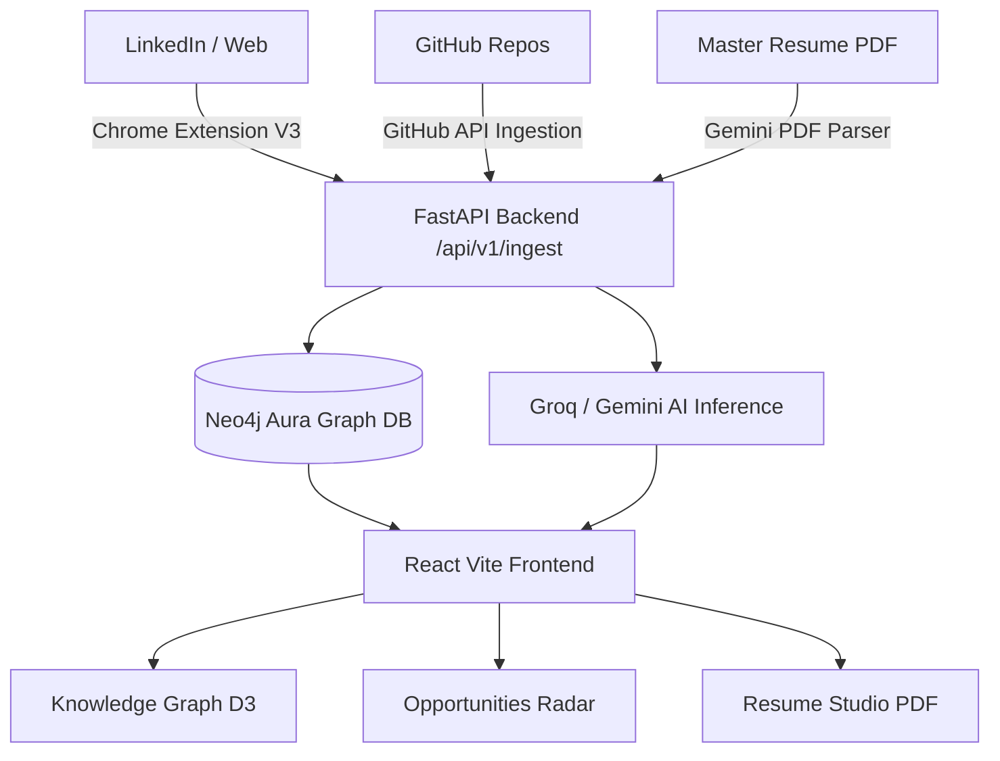

# 🧭 PathPrint

> **Phase 1 Foundation**: Autonomous Skill Topology Graph, Multi-Modal Ingestion, Opportunity Tracker & Dynamic Resume Studio.

---

## 📌 Overview

**PathPrint** transforms fragmented developer footprints—GitHub repositories, LinkedIn profiles, and master resumes—into an interconnected **Skill Topology Knowledge Graph**. 

This repository contains the **Phase 1 Foundation (Milestone 1 / 25% Submissions)** of the platform, establishing the complete end-to-end pipeline from multi-source data ingestion to real-time skill graph visualization, opportunity tracking via Chrome Extension, and ATS resume tailoring.

---

## 🚀 Key Features (Phase 1)

### 1. Candidate Profile & Ingestion Hub
- **Master Resume Parsing**: Upload PDF/DOCX resumes to extract verified contact information, work history, education, and technical competencies.
- **GitHub Repository Analysis**: Synchronize public repositories with automated AST language and skill synthesis.
- **LinkedIn Network Sync**: Ingest experiences, certifications, and connection graphs.
- **Target Preferences**: Set target roles, locations, minimum compensation, and preferred tech stacks.

### 2. Skill Topology Knowledge Graph
- **Interactive Graph Visualizer**: High-performance 2D/3D force-directed canvas displaying relationships across candidate nodes, verified skills, repositories, and companies.
- **NLP Graph Filtering**: Query your skill footprint using natural language (e.g. *"Show backend projects using Python and Docker"*).
- **Node Inspection & Expansion**: Click any node to inspect connected repositories, proficiency ratings, and evidence links.

### 3. Chrome Extension & Opportunities Radar
- **1-Click LinkedIn Sync**: Manifest V3 browser extension captures job listings and profile data directly from LinkedIn into your PathPrint workspace.
- **Kanban & List Pipeline**: Track opportunities through stages (*Saved*, *Applied*, *Interviewing*, *Offer*, *Archived*).
- **Graph-Powered Matchmaker**: Algorithmically scores candidate skill overlap and identifies missing prerequisites for each target job.

### 4. Dynamic ATS Resume Studio
- **Job Description Alignment**: Automatically extracts keywords, required qualifications, and core duties from target job descriptions.
- **Evidence-Backed Tailoring**: Generates tailored project bullet points backed by real code proof points.
- **Multi-Format Export**: Generates pixel-perfect PDFs, standard ATS text, and LaTeX templates.

---

## 🏗️ Architecture & Tech Stack



- **Frontend**: React 18, TypeScript, Vite, Tailwind CSS, Lucide Icons, D3.js
- **Backend**: FastAPI, Python 3.11+, Pydantic v2, Uvicorn
- **Database**: Neo4j AuraDB (Graph Database) & In-Memory Graph Engine
- **AI Models**: Google Gemini 1.5 Flash, Groq LPU (Llama 3.3 70B)
- **Browser Extension**: Chrome Manifest V3 (Vanilla JS / CSS)

---

## ⚡ 1-Click Quickstart

When you clone the repository, you only need to run **one command**:

```bash
git clone https://github.com/YOUR_USERNAME/pathprint.git
cd pathprint
./setup-and-run.sh
```

### What `setup-and-run.sh` does automatically:
1. Verifies system prerequisites (`python3` and `node/npm`).
2. Configures `.env` files automatically from `.env.example`.
3. Creates a Python virtual environment (`./venv`) and installs backend dependencies (`requirements.txt`).
4. Installs frontend npm packages (`node_modules`).
5. Clears ports 8000 and 5173 to prevent conflicts.
6. Launches both the **FastAPI Backend (8000)** and **Vite Frontend (5173)** in parallel.

---

### Access Endpoints
- **Frontend Dashboard**: [http://localhost:5173](http://localhost:5173)
- **FastAPI Core API**: [http://localhost:8000](http://localhost:8000)
- **Interactive API Docs**: [http://localhost:8000/docs](http://localhost:8000/docs)

---

## 🧩 Installing the Chrome Extension

1. Open Google Chrome and navigate to `chrome://extensions/`.
2. Enable **Developer mode** (toggle in the top right corner).
3. Click **Load unpacked**.
4. Select the `pathprint/extension` folder.
5. Click the PathPrint icon in the browser toolbar to connect to your local or cloud backend.

---

## 🛣️ Progressive Hackathon Roadmap

- [x] **Phase 1: Foundation (Current Submission - 25%)**
  - Multi-source candidate ingestion (Resume PDF, GitHub, LinkedIn)
  - Interactive Neo4j Skill Topology Knowledge Graph
  - Chrome Extension job capture & Opportunities Radar
  - ATS Dynamic Resume Studio
- [ ] **Phase 2: Network & Gap Intelligence (Milestone 2 - 50%)**
  - Multi-hop alumni referral discovery & outreach generator
  - Peer coworker benchmark comparisons
- [ ] **Phase 3: Live Real-Time Simulations (Milestone 3 - 75%)**
  - Real-time Gemini Live audio/video interview arena
  - AI sprint-based career growth & skill roadmaps
- [ ] **Phase 4: Autonomous Copilot (Milestone 4 - 100%)**
  - GraphRAG autonomous career agent copilot

---

## 📄 License
MIT License. Built for hackathon demonstration and progressive evaluation.
